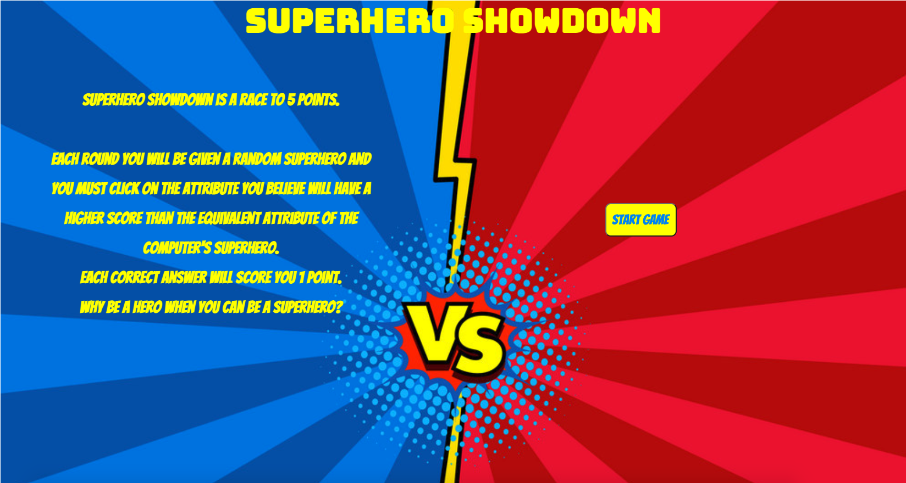

#  Project #2: Superhero Showdown


# Brief

For our second project at GA ‘Reactathon’, we were expected to build a React.js app using a 3rd party API, which was to be pair coded in 48 hours.

# Members 

- Edwyn Abi-Acar - https://github.com/Edwyn26
- Hugo Kinahan - https://github.com/hugokinahan

# Deployment

- Please follow the link to play our game: https://superhero-showdown-hugokinahan.netlify.app/

- Repository link: https://github.com/hugokinahan/sei-project-2

# Motivation

As a pair we wanted to implement our chosen third party API creatively. After deciding on our Superhero API we chose to create a version of the well known game Top Trumps.

Our end product was Superhero Showdown, a Top Trumps like game where users are pitted against the computer after each are given a random Superhero from the Superhero-API. The user must then choose a superhero attribute that they think will outscore the reciprocal attribute on the computer's superhero.

# Frameworks used

- React.js
- axios (for API requests)
- Insomnia
- HTML5
- CSS 3
- JavaScript (ES6)
- Git/Github
- Babel
- Google Fonts
- SASS

# Process

With only 48 hours, we knew that we had to think methodically about the most import aspects of the game to ensure a finished product to be proud of. We made plans on what we thought was achievable and listed some features that we would like to implement if we had time. 

We spent a short time planning and once we had a clear idea we jumped straight into coding. Our first task was to ensure that we could get the Superhero API to appear on our page. This was a smooth process and once test successfully we worked on choosing two random superheros to appear on screen, one as the player and one as the computer. 

```
  const [randomPlayerSuper, setRandomPlayerSuper] = React.useState(null)
  const [randomComputerPlayer, setRandomComputerSuper] = React.useState(null)

  const pickSupers = () => {
    setRandomPlayerSuper(superheroes[Math.floor(Math.random() * superheroes.length)])
    setRandomComputerSuper(superheroes[Math.floor(Math.random() * superheroes.length)])
    setChoice('')
  }
```

After implementing these in the JSX with their 'powerstats' we then had a visual idea of how our application would look. We then had to ensure that the stats of the CPU superhero were hidden until the choice of the player was made on a specific attribute. To do this we used a ternery to show nothing if no choice had been made and to show the stats if a choice had been made by the player. 

```
                <div className="computer-superhero">
                  <h2>{ randomComputerPlayer.name }</h2>
                  
                  <button value="intelligence">Intelligence: {choice ? `${randomComputerPlayer.powerstats.intelligence}` : '' }</button>
                  <button value="strength">Strength: {choice ? `${randomComputerPlayer.powerstats.strength}` : '' }</button>
                  <button value="speed">Speed: {choice ? `${randomComputerPlayer.powerstats.speed}` : '' }</button>
                  <button value="durability">Durability: {choice ? `${randomComputerPlayer.powerstats.durability}` : '' }</button>
                  <button value="power">Power: {choice ? `${randomComputerPlayer.powerstats.power}` : '' }</button>
                  <button value="combat">Combat: {choice ? `${randomComputerPlayer.powerstats.combat}` : '' }</button>
                </div> 
```

After this was added successfully we added a 'next round' button which onClick would pick two new superheroes and would check whether the player or computer had reached the winning score of five. If one of these scores was met, a winning or losing message would appear with th eoption to restart the game. This code can be seen below. 

```
              <button onClick={pickSupers} disabled={!choice || playerWinningScore || computerWinningScore} className="next-button">Next Round</button>
              <button onClick={reloadPage} className="restart-button">Restart Game</button>
```

Once these were finalised we spent our last half day styling the game into a superhero themed application and ensuring that our game was responsive to various screen sizes. 

# Screenshots

Small Screen Homepage


Large Screen Homepage



Game Screen


Winning Screen


# Challenges

The most difficult part of our project was the game logic, in particular enabloing the computer to understand which attribute the user had clicked on, in order to calculate whether the user's attribute choice was greater than that of the computer's.

To get pass this we had to ensure that the value of the of the powerstats were the same on the randomPlayerSuper variable as well as the randomComputerPlayer. Then using a ternery we are able to say that afer a choice has been made, the computer's powerstats should show. 

```
                <div className="player-superhero">
                  <h2>{ randomPlayerSuper.name }</h2>
                  
                  <button onClick={playGame} value='intelligence' disabled={choice}>Intelligence: { randomPlayerSuper.powerstats.intelligence}</button>
                  <button onClick={playGame} value='strength' disabled={choice}>Strength: { randomPlayerSuper.powerstats.strength}</button>
                  <button onClick={playGame} value='speed' disabled={choice}>Speed: { randomPlayerSuper.powerstats.speed}</button>
                  <button onClick={playGame} value='durability' disabled={choice}>Durability: { randomPlayerSuper.powerstats.durability}</button>
                  <button onClick={playGame} value='power' disabled={choice}>Power: { randomPlayerSuper.powerstats.power}</button>
                  <button onClick={playGame} value='combat' disabled={choice}>Combat: { randomPlayerSuper.powerstats.combat}</button>
                </div>
                <div className="computer-superhero">
                  <h2>{ randomComputerPlayer.name }</h2>
                  
                  <button value="intelligence">Intelligence: {choice ? `${randomComputerPlayer.powerstats.intelligence}` : '' }</button>
                  <button value="strength">Strength: {choice ? `${randomComputerPlayer.powerstats.strength}` : '' }</button>
                  <button value="speed">Speed: {choice ? `${randomComputerPlayer.powerstats.speed}` : '' }</button>
                  <button value="durability">Durability: {choice ? `${randomComputerPlayer.powerstats.durability}` : '' }</button>
                  <button value="power">Power: {choice ? `${randomComputerPlayer.powerstats.power}` : '' }</button>
                  <button value="combat">Combat: {choice ? `${randomComputerPlayer.powerstats.combat}` : '' }</button>
                </div> 
  ```
  
  The scoring logic was also challenging, we had to use the e.target.value on both the playerScore and the Computer score to judge whether the attribute picked by the user was greater than that of the computer. Here the Computer score now reciprocates the value of the player's ensuring the same attribute is judged.
  
```
  const playGame = e => {
    const playerScore =  randomPlayerSuper.powerstats[e.target.value]
    const computerScore = randomComputerPlayer.powerstats[e.target.value]
    const playerHasWon = playerScore > computerScore 
    if (playerHasWon) {
      setScore(score + 1)
    } else {
      setCompScore(compScore + 1)
    } 
    setChoice(e.target.value)
  }
  ```

# Wins

We found that the initial implementation of our API to get all of the Superheroes was well executed. Using axios we ensured that the API could be accessed properly and allowed us to log any superheroes that were missing attributes or images. 

```
const [superheroes, setSuperheroes] = React.useState('')

  React.useEffect(() => {
    const getData = async () => {
      try {
        const { data } = await axios.get('https://akabab.github.io/superhero-api/api/all.json')
        setSuperheroes(data)
      } catch (err) {
        console.log(err)
      }
    }
    getData()
  }, [])
```

# Key Learnings

This was my first pair project, and overall the dynamic worked well producing an application we were proud of. 

One aspect that I would improve for the next group or pair project is the delegation of different tasks. In my opinion we spent too much time screen-sharing on the same tasks when these could have easily been delegated, allowing us more time to add more features to our finished application. 

# Future Features

With more time, these are the additional features I would like to add:

- Add different game modes 
  - First to 10, First to 20
- Spent more time refactoring our code into more components
- Make the game mobile responsive


This project was bootstrapped with [Create React App](https://github.com/facebook/create-react-app).

